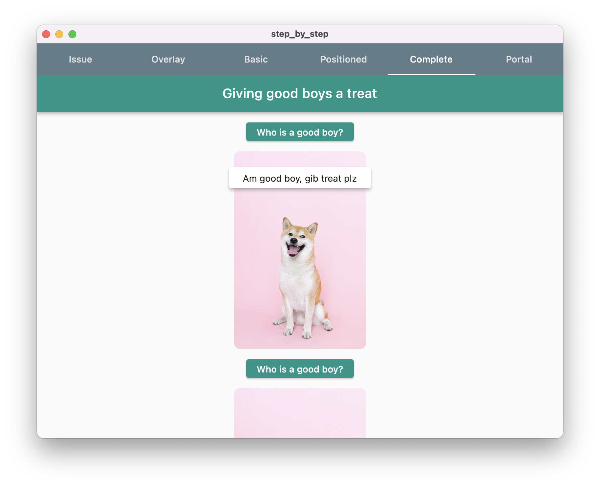
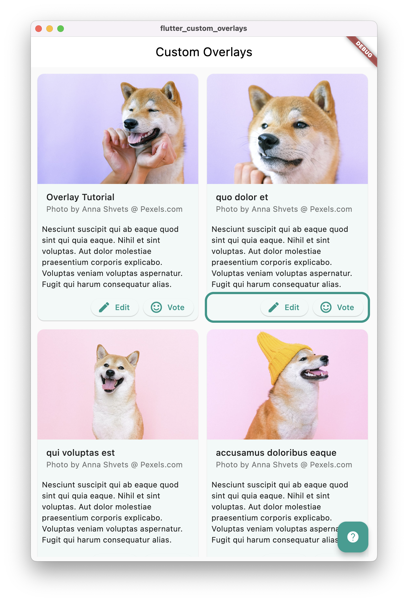

# 🐦 Custom overlays in Flutter

This repository holds two Flutter projects.

## 🚶 Step by step

A project that shows, step by step, how you can implement custom overlays.

Find a more detailed readme on that project [here](step_by_step/README.md).

## 🪄 Flutter custom overlays

This projects tries to show how to use the flutter_portal package to create custom overlays in a life-like scenario.

Find a more detailed readme on that project [here](flutter_custom_overlays/README.md).

