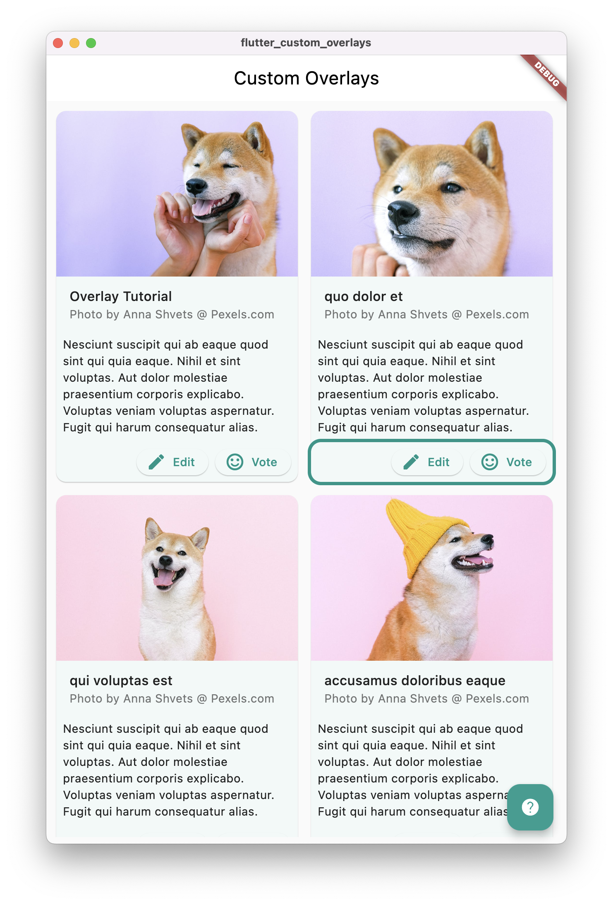

# 🪄 Custom Overlays in Flutter

This project is to show how you could use [flutter_portal](https://pub.dev/packages/flutter_portal) to implement custom overlays in your app. 

To give the example a more life-like look and feel, I created some very basic widgets.

[Basic Card](lib/widgets/basic_card.dart) is a simple composition of default Flutter widgets, which also has a [PortalTarget](https://pub.dev/documentation/flutter_portal/latest/flutter_portal/PortalTarget-class.html) that can be used to display a [TutorialIndicatorOverlay](lib/widgets/tutorial_indicator_overlay.dart) widget around the button bar.

To get started, I recommend you the check out the project and run it. Than take a look into the code and comprehend what happens and why.

If any questions arise or you'd like to see more examples, please [create an issue](https://github.com/inf0rmatix/flutter-custom-overlays/issues/new/choose).

